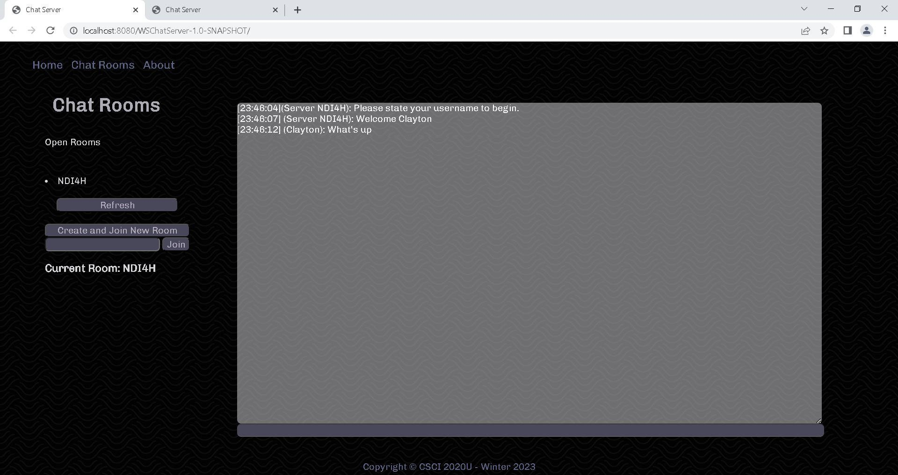
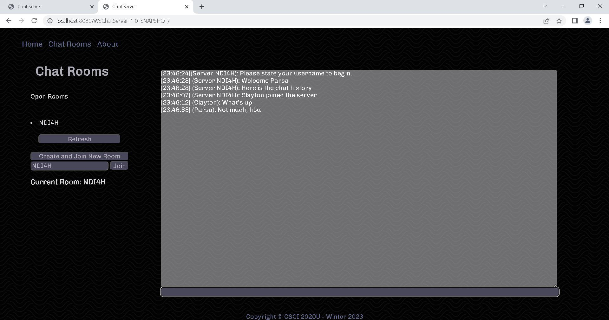

  

## readme.md

  
  

### Project Information

Assignment 2 is a website chat server that allows multiple clients to create and join rooms using unique room codes to communicate with eachother. This project was developed using IntelliJ's backend development platform with GlassFish 7.0 and Java communicated to a front end JavaScript WebSocket.

&nbsp;

Figure 1. Chat server first client room intialization screenshot.

&nbsp;

Figure 1. Chat server secondary client room join screenshot.
  

These figures show the multi-client interaction on a single chat server where client 1 joins and speaks, and client 2 see this room when they refresh their open rooms list, joins, sees the chats history and responds.

&nbsp;

  

This assignment was completed by:

  

- Parsa Zahraei Mohammadabady 100749173

- Clayton Cotter-Wasmund 100824037

  
  
  
  
  

&nbsp;

  

&nbsp;

  

### Improvements
Improvements to the server are that we display the chat history to new users, and for pre-existing users, the room code list is automatically updated. Refreshes will only be needed for new users due to how the client was set up to interact with the server in the original and demo code given.
  
  

&nbsp;

  

&nbsp;

  

### How To Run

1. Clone this repository into your desired folder.

2. Launch this repository in intelliJ with administrator privileges.

3. Add a configuration to open a local GlassFish server with OpenJDK and deploy the exploaded artifact with the 'play' button.

4. Launch any .html page through intelliJ by running it as the current file, which is in the same drop down as the GlassFish configuration, then hit the 'play' button.

5. Navigate to index.html by selecting 'Chat Room' with the navigation bar in the header on each page (if not their already).

6. Create a new room using the 'Create and Join a New Room' button, or join an existing room by typing in its unique room code into the input field below and clicking the 'Join' button beside it.

7. Type your name into the chats input field to register your user.

8. To create new clients by simply opening up new browser instances of the program and repeat steps 6 & 7.

9. To view all open chat rooms codes press the refresh button to update the list.

  

&nbsp;

  

&nbsp;

  

### Resources

[w3Schools](https://www.w3schools.com/)

- General css documentation

  

[Coolors](https://coolors.co/eae8ff-d8d5db-adacb5-2d3142-b0d7ff)

- Colour pallette help

  

[TopTal](https://www.toptal.com/designers/subtlepatterns/uploads/papyrus-dark.png)

- Website background image

  

[webtoolkit](https://www.webtoolkit.eu/wt)

- Scrollbar manipulation

  

### Credits

  

This assignment was completed by:

  

- Parsa Zahraei Mohammadabady 100749173

- Clayton Cotter-Wasmund 100824037